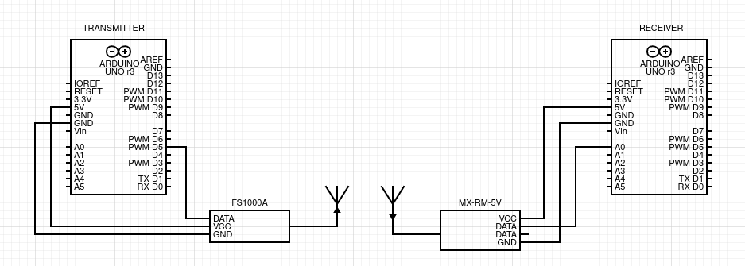

# Basic ATMEGA328P Radio Transmission Library

This library contains code for using low cost transmitters and receivers with the ATMEGA328P. Two transmitter/receiver pairs are provided -- one digital and one analog. These add wireless capability to the ATMEGA328P and can be used for many purposes. For example, the video below shows a robot driving wirelessly using the analog transmitter/receiver.

[Wireless robot controller](https://youtu.be/JEVDt-vkEO8)

The image below shows an example setup for a transmitter and receiver pair. The particular chips in this image are the FS1000A (transmitter) and the MX-RM-5V (receiver). Quarter wave antennas are attached to the chips. These operate at 433 MHz, so the antennas are 17.3 cm long. The wiring is shown below.

---

## Digital Transmitter/Receiver

The digital transmitter/receiver transfers up to 400 bits per second, but it is highly susceptible to noise.

The protocol (shown below) consists of four sequential parts:

###### Sync Pulses
  - Send a series of synchronization pulses so the receiver can detect the transmission
###### Start Transfer
  - Send a double period pulse to signify the start of data transfer
###### Data
  - Send low and high duty pulses to signify zero and one bits
###### End Transfer
  - Send two double period pulses to signify the end of data transfer

### Transmitter

The transmitter definitions are located at src/tx_digital.h:

`txSend(uint8_t* buffer, uint8_t length, uint8_t blocking)`

- Transmits data from buffer[0] to buffer[length - 1] (or empty message if length = 0)
- Blocks if non-zero value is passed to blocking

### Receiver

The receiver definitions are located at src/rx_digital.h:

`rxInit(uint8_t adcPin)`

- Starts the receiver on the specified adc pin. (portc)

`rxRecv(uint8_t** buffer, uint8_t* length)`

- Checks if the receiver has any data. If yes, buffer is pointed to data[0] and length is set to the payload length
- Returns receiver state (RX_NOISE, RX_SYNC, RX_TRANSFER, RX_COMPLETE, RX_FAILED)
- State can also be retrieved using RX_STATE (to avoid call to rxRecv)

### Demo

An example using the digital transmitter/receiver is located in examples/digital-txrx. The clip below shows a demo of the example.

The transmitter is at the top. The transmission indicator is on when transmitting.

The receiver is on the bottom. The reception indicator is turned on after the correct message is received.

---

## Analog Transmitter/Receiver

The analog transmitter/receiver continuously sends two 8 bit values.

The protocol (shown below) encodes data (a, b) in the rate and duty of each pulse:

### Transmitter

The transmitter definitions are located at src/tx_analog.h:

`txStart()`

- Starts the transmitter

`txSend(uint8_t a, uint8_t b)`

- Transmits a and b

`txStop()`

- Stops the transmitter

### Receiver

The receiver definitions are located at src/rx_analog.h:

`rxInit(uint8_t adcPin)`

- Starts the receiver on the specified adc pin. (portc)

`rxRecv(uint8_t* a, uint8_t* b)`

- Gets current values from receiver
- Returns receiver state (RX_NOISE, RX_SYNC)

### Demo

An example using the analog transmitter/receiver is located in examples/analog-txrx. The clip below shows a demo of the example.

The transmitter is at the top. The transmission indicator is on when transmitting.

The receiver is on the bottom. The reception indicator is on when a signal is detected.
